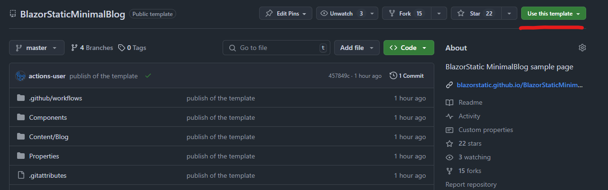

## Changes and Breaking Changes

- In `BlazorStaticContentOptions`, tag-related options have been moved to a new class, `TagsOptions`:

    ```csharp
    opt.AddTagPagesFromPosts = true // old
    opt.Tags.AddTagPagesFromPosts = true // new
    ```

- **Tags now work with encoding**, ensuring URLs function correctly with tags like `c#`, `something with spaces`, etc.
    - A new option has been added: `opt.Tags.TagEncodeFunc`, which defaults to `WebUtility.UrlEncode`.
    - A new `Tag` class has been introduced with properties `Name` (the plain string as presented in front matter) and `EncodedName` (used in URLs and filenames).
    - Tags are now a property within the `Post` class, with `BlazorStaticContentService` handling encoding. Use this property instead of `Tags` in `FrontMatter`.

- Tags are no longer enforced through `IFrontMatter`. To use tags, your `FrontMatter` class must implement `IFrontMatterWithTags`.
    - `BlazorStatic` will use the `List<string> Tags` in your `FrontMatter` and encode them accordingly. Each `Post` now contains a `List<Tag>`.
    - Use `Post.Tags` instead of `Post.FrontMatter.Tags`, as the former provides both `Name` and `EncodedName` properties.

- To access all unique tags, use the `BlazorStaticContentService.AllTags` property.


## .NET9 support

- Wasn't that difficult 🙂. Just adding the `.net9.0` to target frameworks in `BlazorStatic.csproj`.

## New Domain and GitHub Organization

BlazorStatic has moved to its own GitHub organization. The repository links are now:

- [github.com/BlazorStatic/BlazorStatic](https://github.com/BlazorStatic/BlazorStatic) (instead of the previous user-based URL)

The project homepage also has its own second-level domain:

- [BlazorStatic.net](https://blazorstatic.net) — the .net domain is a fitting choice for a .NET-based project.

## Cloudflare Pages support

Check the result on https://blazorstatic.pages.dev/ and the guide [here](docs/deployment).

## Licence change

The license has been changed from the more restrictive AGPL to the less restrictive MIT.

## Readme.md updates

Now it explains better what is BlazorStatic about.

## Record on jamstack.org

We’ve added BlazorStatic to the popular list of static site generators on [jamstack.org](https://jamstack.org/generators/).

## Nuget package updates

Updated the `YamlDotNet` and `Markdig` to keep up with the newest versions!

## BlazorStatic nuget package update

Better readme, new repo url, `<PackageProjectUrl>` to our brand-new domain.

## BlazorStatic.Templates and BlazorStaticMinimalBlog Repos

We’ve done some reorganization and created a new repo to house all the templates you can create with `dotnet new`.

Right now, there’s one template: `dotnet new BlazorStaticMinimalBlog`, but more are expected to be added in the future.

Check out the [BlazorStatic.Templates repo](https://github.com/BlazorStatic/BlazorStatic.Templates). It includes a GitHub action:
[build-github-template.yml](https://github.com/BlazorStatic/BlazorStatic.Templates/blob/7cbf00a5a60bcb7bb2736e886547bf04c68878e5/.github/workflows/build-github-template.yml),
which installs the `dotnet new` template, runs `dotnet new BlazorStaticMinimalBlog`, and pushes the result to [BlazorStaticMinimalBlog](https://github.com/BlazorStatic/BlazorStaticMinimalBlog)—now a read-only GitHub "green button" template.

This "green button template" provides a two-click way to get a BlazorStatic website running in your own repo, with no additional maintenance required. This allows us to focus entirely on the `dotnet new` template.



As part of this change, the `BlazorStaticMinimalBlog` submodule has been removed from the main repo, and the `BlazorStatic.Templates` repo is no longer part of the main repo either.

There are more updates coming to `BlazorStatic.Templates`.

## Feedback

Share your feedback by [creating an issue](https://github.com/BlazorStatic/BlazorStatic/issues/new) or join the conversation on the [Discord server](https://discord.gg/DsAXsMuEbx).

